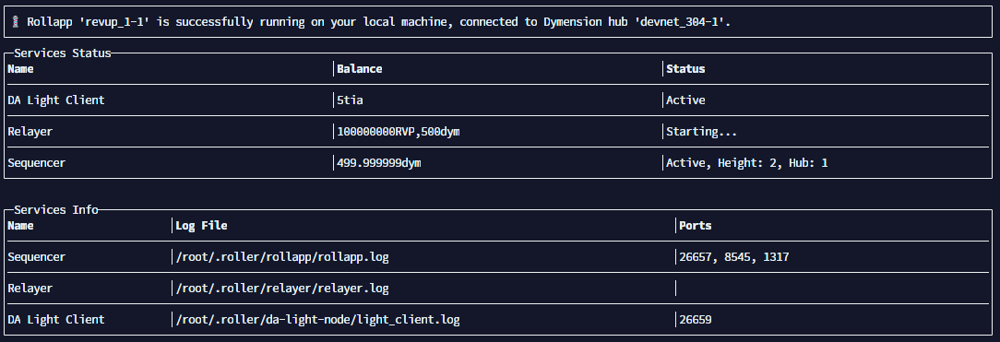

# 🟢 Viper Private Phase 2

Update version PT-0.1.7

```
// amd64
sudo systemctl stop viper.service \
cd viper-binaries && sudo git pull origin main && sudo cp viper_linux_amd64 /usr/local/bin/viper \
sudo systemctl start viper.service \
viper network version

// arm64
sudo systemctl stop viper.service \
cd viper-binaries && sudo git pull origin main && sudo cp viper_linux_arm64 /usr/local/bin/viper \
sudo systemctl start viper.service \
viper network version


// Check Node & Validator
curl http://127.0.0.1:26657/status
Note:
If: "catching_up": false -> Sync done
If: "validator_info": null -> Jail

// Unjail
viper servicers unjail <Address-Validator>  <Address-Node>  testnet
Note: Validator address and Node address same

// Check log
sudo journalctl -u viper -f -o cat
```

**Update data: \***

```
cd $HOME/.viper && rm -r data && sudo git clone https://github.com/vishruthsk/data.git data && sudo chown -R viper ~/.viper/data
sudo systemctl start viper.service
```

```
// Discord DYM
https://discord.gg/dymension

//Docs DYM
https://docs.dymension.xyz/build/roller/start/install

//Faucet Celestia
https://faucet.celestia-arabica-11.com
```

**Install Package:**

```
sudo apt update && sudo apt upgrade -y
sudo apt install curl git make wget htop tmux build-essential jq make lz4 gcc unzip -y  
```

**Install Roller DYM:**

```
curl -L https://dymensionxyz.github.io/roller/install.sh | bash
```

**Check version:**

```
roller version
```

**Run config init:**

```
roller config init --interactive
```

Note:\
Select your network: Froopyland\
Select your execution environment: EVM\
Specify your RollApp denom: Name options (You should choose a personal name to avoid duplicates)\
Set the genesis token supply: Enter for default\
Choose your data layer: Celestia

**Faucet**:

```
// Faucet for DYM: Discord channel #froodyland-faucet
Command: 
$request <dym-address> 
$request <dym-address>

//Faucet for Celestia: https://faucet.celestia-arabica-11.com or Discord
```

**Register**:

```
roller tx register

//Rollapp '<rollapp-id>' has been successfully registered on the hub.
```

Run:&#x20;

```
roller run
```

<figure><figcaption></figcaption></figure>

* <mark style="color:red;">**Err Releyer stating... or create :**</mark>

```
nano ~/.roller/relayer/config/config.yaml

// Edit:
min-loop-duration: 100ms

and

src-channel-filter:
      rule: "allowlist"
      channel-list: ["channel-0", "channel-49"]

// Download & tar binary relayer new version:
wget https://github.com/dymensionxyz/go-relayer/releases/download/v0.3.1-v2.5.2-relayer/Cosmos.Relayer_0.3.1-v2.5.2-relayer_linux_amd64.tar.gz

tar -xvf Cosmos.Relayer_0.3.1-v2.5.2-relayer_linux_arm64.tar.gz

mv Cosmos\ Relayer_0.3.1-v2.5.2-relayer_linux_arm64/rly /usr/local/bin/roller_bins/
```


**Setup & Config Viper phase 2:**

```
echo "[
  {
    "id": "0001",
    "url": "http://localhost:8082/",
    "basic_auth": {
      "username": "",
      "password": ""
    }
  },
  {
    "id": "0002",
    "url": "$DYM(EVM) URL",
    "basic_auth": {
      "username": "",
      "password": ""
    }
  }
]" > ~/.viper/config/blockchains.json
```

Note: Change your url DYM (Ex: 111.222.333.444:8545)

Faucet Viper phase 2: Discord

**Stake**:&#x20;

```
viper servicers stake self <addr> <amt> 0001,0002 $GEO-ID <viper node URL:443 or 8082> testnet
```

<mark style="color:red;">After the installation is complete. Please restart the server</mark>

**Check Node & Validator status:**

```
curl http://127.0.0.1:26657/status
```

**Check DYM**&#x20;

```
curl -X POST \
     -H "Content-Type: application/json" \
     --data '{"jsonrpc":"2.0","method":"eth_blockNumber","params":[],"id":1}' \
     http://<your_node_ip>:<your_node_port>
     
// The results you will get are similar
curl -X POST      -H "Content-Type: application/json"      --data '{"jsonrpc":"2.0","method":"eth_blockNumber","params":[],"id":1}'      http://ip:8545
{"jsonrpc":"2.0","id":1,"result":"0xcbc"}
```


**Wallet & Backup:**

<pre><code>// Check balance
viper wallet query account-balance your_wallet_address

// Recovery Wallet
viper wallet import-encrypted
or
viper wallet import-raw

// Fetch Wallet Info
viper wallet fetch-account your_wallet_address

<strong>// List all account
</strong>viper wallet list-accounts

//Change wallet password
viper wallet change-pass your_wallet_address --pwd-new input-new-passwd --pwd-old input-old-passwd

// See Private key
viper wallet export-encrypted
or
viper wallet export-raw

// Query Your Validator
viper servicers query servicer your_wallet_address

// Backup
Folder .viper or validator_private_key.json
</code></pre>

**Command**:

```
// Reload Service
sudo systemctl daemon-reload

// Check logs of the node
sudo journalctl -u viper -f -o cat

// Restart the node
sudo systemctl restart viper.service

//Stop the node
sudo systemctl stop viper.service 

// Check height
viper network query current-heights

// Check Node 
curl http://127.0.0.1:26657/status
```
