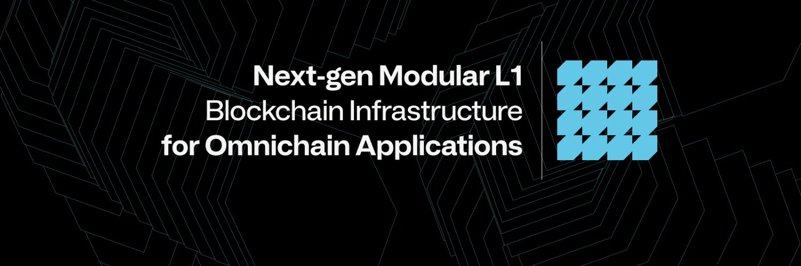

# 🟢 Warden Protocol

<figure><figcaption></figcaption></figure>

**Hardware minimum:**&#x20;

* 4 core
* 8 GB RAM
* 80 GB SSD NVMe
* Ubuntu 22 - x86 or arm

\
Website: [https://wardenprotocol.org](https://wardenprotocol.org)\
Telegram: [https://t.me/wardenprotocol](https://t.me/wardenprotocol)\
Discord: [https://discord.gg/wardenprotocol](https://discord.gg/wardenprotocol)\
X: [https://x.com/wardenprotocol](https://x.com/wardenprotocol)\
\
Node39 support:

* [x] RPC: [https://warden-testnet-rpc.node39.top](https://warden-testnet-rpc.node39.top)
* [x] API: [https://warden-testnet-rpc.node39.top](https://warden-testnet-rpc.node39.top)
* [x] Snapshort: Every 4 hours
* [x] Dashboard: [https://dashboard.node39.top/warden-testnet/](https://dashboard.node39.top/warden-testnet/)

#### &#x20;
